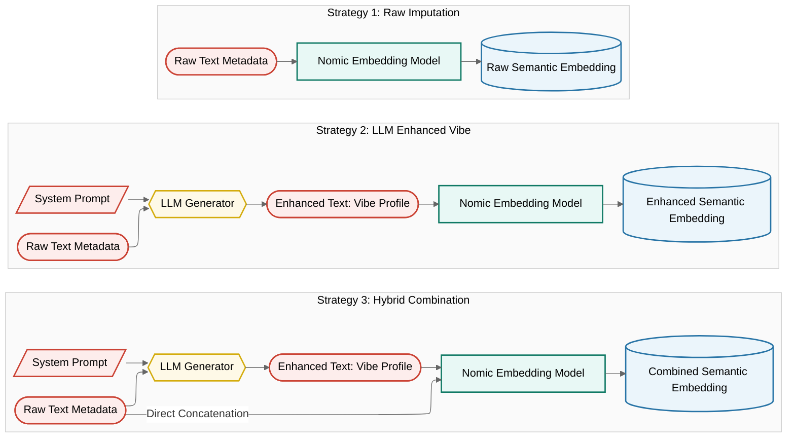

```mermaid
%%{init: {'flowchart': {'defaultRenderer': 'elk'}, 'theme': 'base', 'themeVariables': { 'fontFamily': 'arial', 'primaryColor': '#ffffff', 'primaryBorderColor': '#333333', 'lineColor': '#666666', 'clusterBkg': '#fafafa', 'clusterBorder': '#cccccc'}}}%%

flowchart TD;
    %% STRATEGY 1
    subgraph S1 [Strategy 1: Raw Imputation];
        direction LR;
        R1([Raw Text Metadata]) --> E1[Nomic Embedding Model];
        E1 --> RE[(Raw Semantic Embedding)];
    end;

    %% STRATEGY 2
    subgraph S2 [Strategy 2: LLM Enhanced Vibe];
        direction LR;
        R2([Raw Text Metadata]) --> LLM2{{LLM Generator}};
        P2[/System Prompt/] --> LLM2;
        LLM2 --> ET2([Enhanced Text: Vibe Profile]);
        ET2 --> E2[Nomic Embedding Model];
        E2 --> EE[(Enhanced Semantic Embedding)];
    end;

    %% STRATEGY 3
    subgraph S3 [Strategy 3: Hybrid Combination];
        direction LR;
        R3([Raw Text Metadata]) --> LLM3{{LLM Generator}};
        P3[/System Prompt/] --> LLM3;
        LLM3 --> ET3([Enhanced Text: Vibe Profile]);
        R3 -- Direct Concatenation --> E3[Nomic Embedding Model];
        ET3 --> E3;
        E3 --> CE[(Combined Semantic Embedding)];
    end;

    %% Force Top-to-Bottom Ordering
    S1 ~~~ S2;
    S2 ~~~ S3;

    %% Apply visual styling classes
    classDef input fill:#fdedec,stroke:#cb4335,stroke-width:2px,color:#000;
    classDef model fill:#e8f8f5,stroke:#117a65,stroke-width:2px,color:#000;
    classDef generator fill:#fef9e7,stroke:#d4ac0d,stroke-width:2px,color:#000;
    classDef output fill:#ebf5fb,stroke:#2874a6,stroke-width:2px,color:#000;

    class R1,R2,P2,R3,P3 input;
    class E1,E2,E3 model;
    class LLM2,LLM3 generator;
    class RE,EE,CE output;
    class ET2,ET3 input;
```